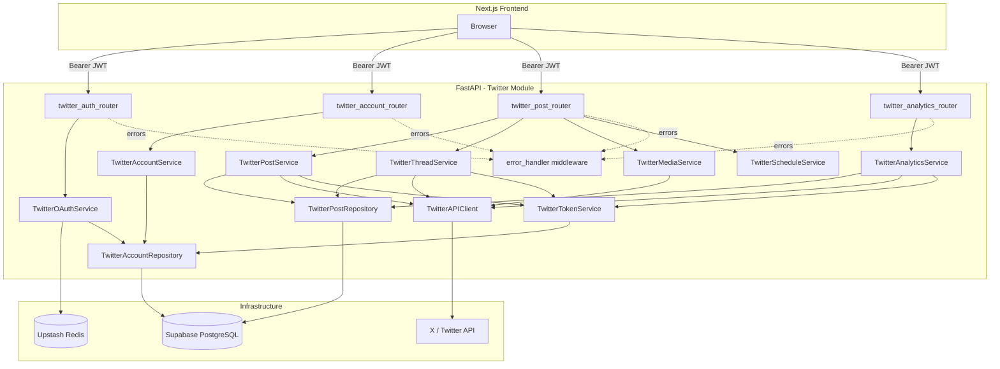
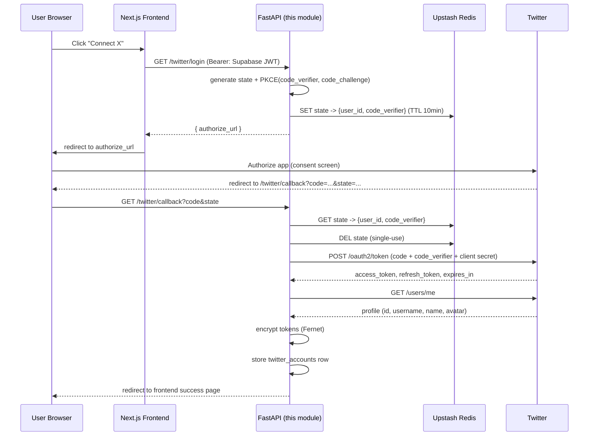
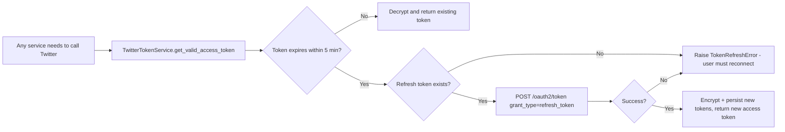

# X (Twitter) Integration Module

Production-ready X (Twitter) integration for the Social Media Management Tool.
Built as an independently-owned module: OAuth connection, posting, threads,
media upload, and analytics for X/Twitter.

This module owns **only** the Twitter integration. It does not own LinkedIn,
Meta, the AI Writer, the frontend, or the scheduler execution — see
[Scope & Integration Boundary](#scope--integration-boundary) below.

---

## Table of Contents

- [Tech Stack](#tech-stack)
- [Folder Structure](#folder-structure)
- [Installation](#installation)
- [Environment Variables](#environment-variables)
- [Running the Module](#running-the-module)
- [Architecture](#architecture)
- [OAuth Flow](#oauth-flow)
- [Token Refresh Flow](#token-refresh-flow)
- [Posting Flow](#posting-flow)
- [Thread Flow](#thread-flow)
- [Scheduling Contract](#scheduling-contract)
- [Analytics Flow](#analytics-flow)
- [Database Schema](#database-schema)
- [API Reference](#api-reference)
- [Security](#security)
- [Testing](#testing)
- [Scope & Integration Boundary](#scope--integration-boundary)
- [Known Limitations & Things to Re-verify](#known-limitations--things-to-re-verify)

---

## Tech Stack

| Concern | Technology |
|---|---|
| API framework | FastAPI (async) |
| Validation | Pydantic v2 |
| Database | Supabase PostgreSQL (via `supabase-py`) |
| Auth (incoming requests) | Supabase Auth (JWT verified in this module) |
| Ephemeral state | Upstash Redis (REST API) |
| Token encryption | Fernet (`cryptography`) |
| Twitter API | X API v2 (OAuth 2.0 + PKCE), v1.1 media upload |
| Testing | pytest, pytest-asyncio |
| Linting | ruff, mypy |
| CI/CD | GitHub Actions |

---

## Folder Structure

```
app/
├── api/
│   ├── deps.py                  # Dependency injection wiring
│   └── routers/                 # HTTP layer (thin — no business logic)
│       ├── twitter_auth_router.py
│       ├── twitter_account_router.py
│       ├── twitter_post_router.py
│       └── twitter_analytics_router.py
├── config/
│   └── settings.py              # Validated env config (single source of truth)
├── core/
│   ├── security.py              # Token encryption + Supabase JWT verification
│   ├── redis_client.py          # Upstash Redis REST wrapper (OAuth state)
│   └── supabase_client.py       # Supabase client factory
├── exceptions/
│   └── twitter_exceptions.py    # Custom exception hierarchy
├── middleware/
│   └── error_handler.py         # Global exception -> JSON response translation
├── models/                      # Internal DB-row representations
│   ├── twitter_account_model.py
│   └── twitter_post_model.py
├── repositories/                # ONLY layer allowed to query Supabase
│   ├── twitter_account_repository.py
│   └── twitter_post_repository.py
├── schemas/                     # Pydantic request/response contracts
│   ├── twitter_auth_schema.py
│   ├── twitter_account_schema.py
│   ├── twitter_post_schema.py
│   └── twitter_analytics_schema.py
├── services/                    # Business logic
│   ├── twitter_client.py        # Low-level HTTP client (retry/backoff/429)
│   ├── twitter_oauth_service.py
│   ├── twitter_token_service.py
│   ├── twitter_account_service.py
│   ├── twitter_post_service.py
│   ├── twitter_media_service.py
│   ├── twitter_thread_service.py
│   ├── twitter_schedule_service.py
│   └── twitter_analytics_service.py
├── utils/
│   ├── logger.py                # Centralized logging + secret redaction
│   └── oauth_pkce.py            # PKCE + CSRF state generation
├── twitter_module.py            # <-- SINGLE MOUNT POINT for the main app
└── main.py                      # Standalone entrypoint for local dev/testing

migrations/
├── 001_create_twitter_accounts.sql
└── 002_create_twitter_posts.sql

tests/
├── conftest.py                  # Shared fixtures (fake accounts, mocked env)
├── unit/                        # Service-layer tests, no network/DB
├── integration/                 # Full-router tests via FastAPI TestClient
└── mocks/twitter_api_mock.py    # Fake Twitter API responses

.github/workflows/twitter-module-ci.yml   # Lint, type-check, test, security scan
```

**Why this layering:** dependencies flow strictly one direction —
`routers → services → repositories → database`. Routers never touch Supabase
or Twitter directly. Only `repositories/` queries the database. Only
`services/twitter_client.py` talks to Twitter's HTTP API. This keeps every
layer independently testable and makes future changes (e.g. swapping
Supabase for raw SQLAlchemy) a one-file change instead of a rewrite.

---

## Installation

```bash
git clone <repo-url>
cd <repo>

python3 -m venv .venv
source .venv/bin/activate        # Windows: .venv\Scripts\activate

pip install -r requirements.txt

cp .env.example .env
# Fill in real values in .env — see Environment Variables below
```

## Environment Variables

All variables are validated at startup by `app/config/settings.py` — the
app refuses to boot if any required value is missing. See `.env.example`
for the full annotated list. Summary:

| Variable | Source |
|---|---|
| `TWITTER_CLIENT_ID` / `TWITTER_CLIENT_SECRET` | X Developer Portal → App → OAuth 2.0 |
| `TWITTER_REDIRECT_URI` | Must exactly match a registered callback URL |
| `TWITTER_API_KEY` / `TWITTER_API_KEY_SECRET` | X Developer Portal → App → Keys and tokens (OAuth 1.0a, legacy) |
| `TWITTER_BEARER_TOKEN` | X Developer Portal → App → Keys and tokens |
| `TOKEN_ENCRYPTION_KEY` | Generate: `python -c "from cryptography.fernet import Fernet; print(Fernet.generate_key().decode())"` |
| `SUPABASE_URL` / `SUPABASE_SERVICE_ROLE_KEY` / `SUPABASE_JWT_SECRET` | Supabase project settings |
| `UPSTASH_REDIS_REST_URL` / `UPSTASH_REDIS_REST_TOKEN` | Upstash console |

Generate a new `TOKEN_ENCRYPTION_KEY` per environment (dev/staging/prod) —
**never reuse the same key across environments**, and never commit `.env`.

## Running the Module

```bash
# Apply migrations first (run against your Supabase project, e.g. via
# the Supabase SQL editor or `supabase db push` with the CLI):
#   migrations/001_create_twitter_accounts.sql
#   migrations/002_create_twitter_posts.sql

uvicorn app.main:app --reload --port 8000
```

Then open **http://localhost:8000/docs** for interactive Swagger UI.

---

## Architecture



**Key rule enforced throughout:** only `TwitterTokenService.get_valid_access_token()`
is ever called to obtain a usable token. No service reads `account.access_token`
directly — this guarantees the auto-refresh check happens consistently
everywhere, not just in the code paths someone remembered to add it to.

---

## OAuth Flow



CSRF is defended by the single-use `state` value; code interception is
defended by PKCE (`code_verifier` never leaves the backend until the final
token exchange).

## Token Refresh Flow



No manual re-login is ever required as long as `offline.access` was granted
at connect time and the user hasn't revoked access from Twitter's side.

## Posting Flow

```
POST /twitter/post
  → resolve account + build authenticated TwitterAPIClient (auto-refresh)
  → create twitter_posts row (status=publishing)
  → create twitter_post_items row (status=publishing)
  → POST /2/tweets { text, media }
  → on success: mark item + post PUBLISHED, return tweet_id + URL
  → on failure: mark item + post FAILED, re-raise
```

## Thread Flow

```
POST /twitter/post/thread
  → pre-create ALL post_items rows (status=draft) — full intended thread visible immediately
  → for each tweet, IN ORDER:
      → POST /2/tweets { text, media, reply.in_reply_to_tweet_id: <previous tweet_id> }
      → mark that item PUBLISHED
  → on failure at item N:
      → mark item N FAILED
      → rollback: DELETE all successfully-posted tweets (newest first, best-effort)
      → mark post FAILED
      → raise ThreadPostingError(posted_tweet_ids=[...]) — caller knows exact rollback state
  → on full success: mark post PUBLISHED, return all tweet_ids in order
```

## Scheduling Contract

This module **does not execute scheduling** (no Celery task lives here).
`POST /twitter/post/schedule` only persists a row with `status='scheduled'`
and a `queue_metadata` JSON bag. The scheduler-owning teammate's worker is
expected to:

1. Query `twitter_posts` where `status='scheduled' AND scheduled_time <= now()`
   (exposed via `TwitterPostRepository.list_scheduled_due()`)
2. Call `TwitterPostService.post_tweet()` or `TwitterThreadService.post_thread()`
   directly (these are plain async Python functions — no FastAPI/HTTP
   dependency required to call them from a Celery task)
3. Update `queue_metadata` with their own execution bookkeeping as needed

## Analytics Flow

```
GET /twitter/analytics/tweet/{tweet_id}?twitter_account_id=...
  → resolve account + build authenticated client
  → GET /2/tweets/{id}?tweet.fields=public_metrics,non_public_metrics
  → normalize into { likes, retweets, replies, quotes, bookmarks, impressions }
     (impressions is null, not 0, when unavailable at the caller's API tier)

GET /twitter/analytics/thread/{post_id}?twitter_account_id=...
  → look up all published items for the thread
  → fetch + normalize metrics for each tweet_id
  → return per-tweet breakdown + summed totals
```

---

## Database Schema

### `twitter_accounts`

| Column | Type | Notes |
|---|---|---|
| `id` | uuid PK | |
| `user_id` | uuid FK → `auth.users` | |
| `twitter_user_id` | text | Twitter's numeric user ID |
| `username`, `display_name`, `profile_image_url` | text | |
| `access_token`, `refresh_token` | text | **Fernet-encrypted ciphertext**, never plaintext |
| `scope` | text | Space-separated granted scopes |
| `expires_at` | timestamptz | |
| `is_active` | boolean | Soft-delete flag for disconnect |
| `created_at`, `updated_at` | timestamptz | |

Unique constraint on `(user_id, twitter_user_id)` — reconnecting reactivates
the existing row rather than duplicating it. RLS enabled with `select`/`update`
policies scoped to `auth.uid() = user_id` as defense-in-depth (this backend
uses the service-role key and enforces scoping in application code).

### `twitter_posts` / `twitter_post_items`

`twitter_posts`: one row per publish action (single tweet or thread), with
`post_type`, `status`, `scheduled_time`, `queue_metadata`.

`twitter_post_items`: one row per individual tweet within that action
(`sequence_order`, `text`, `media_ids`, `twitter_tweet_id`, `status`,
`error_message`). Exactly 1 row for a single tweet, N rows for a thread.

See `migrations/001_create_twitter_accounts.sql` and
`migrations/002_create_twitter_posts.sql` for full DDL, indexes, and comments.

---

## API Reference

| Method | Path | Purpose |
|---|---|---|
| GET | `/twitter/login` | Get Twitter OAuth 2.0 authorize URL |
| GET | `/twitter/callback` | OAuth redirect target (browser-facing) |
| GET | `/twitter/accounts` | List connected accounts |
| DELETE | `/twitter/accounts/{id}` | Disconnect an account |
| POST | `/twitter/media/upload` | Upload image/GIF/video, get `media_id` |
| POST | `/twitter/post` | Post a single tweet |
| POST | `/twitter/post/thread` | Post a multi-tweet thread |
| POST | `/twitter/post/schedule` | Persist a post for later publishing |
| GET | `/twitter/analytics/tweet/{tweet_id}` | Single tweet metrics |
| GET | `/twitter/analytics/thread/{post_id}` | Thread metrics + totals |
| GET | `/health` | Health check |

Full request/response schemas, examples, and error codes are documented
live in Swagger at `/docs` and ReDoc at `/redoc` once the app is running —
every endpoint and schema field in this module has a `description` and
`examples` value feeding directly into that generated documentation.

---

## Security

- **Tokens encrypted at rest** (Fernet, application-layer key never stored
  in the database) — see `app/core/security.py`.
- **PKCE + single-use `state`** on every OAuth flow — see `app/utils/oauth_pkce.py`
  and `app/services/twitter_oauth_service.py`.
- **Least-privilege scopes** requested (`tweet.read tweet.write users.read offline.access`).
- **No secrets ever cross into response schemas** — `TwitterAccountResponse`
  structurally has no token fields; routers construct it explicitly field-by-field.
- **Log redaction** — `app/utils/logger.py::safe_log_context()` strips token/secret
  keys before anything is logged.
- **User-scoped queries everywhere** — every repository method filters by
  `user_id`, since the service-role Supabase key bypasses RLS (RLS itself is
  still enabled as defense-in-depth).
- **`.env` is gitignored**; only `.env.example` (placeholders) is committed.

## Testing

```bash
pytest tests/ -v                                  # run everything
pytest tests/unit/ -v                              # service-layer only, no network/DB
pytest tests/integration/ -v                        # full-router tests via TestClient
pytest tests/ --cov=app --cov-report=term-missing   # with coverage
```

22 tests currently cover: token encryption round-trip and tamper detection,
silent token refresh (including the no-refresh-token and refresh-failure
paths), single tweet posting (including media attachment and failure
recording), thread posting (ordering, reply-chaining, and rollback on
partial failure), full OAuth login/callback flow (including invalid-state
and user-denied paths), and account listing/disconnection with a check that
tokens never leak into responses.

All Twitter API calls are mocked (`tests/mocks/twitter_api_mock.py`) — the
suite makes zero real network calls and can run entirely offline in CI.

---

## Scope & Integration Boundary

This module owns: OAuth login/callback, token storage/refresh, multi-account
management, tweet/thread posting, media upload, scheduling **persistence**
(not execution), analytics.

This module explicitly does **not** own: LinkedIn/Meta integrations, the AI
Writer (Gemini), the Next.js frontend, or the Celery scheduler's execution
loop. Integration points for other teammates:

- **Frontend**: calls this module's endpoints with `Authorization: Bearer <supabase_jwt>`.
- **Scheduler module**: reads `twitter_posts` rows via `TwitterPostRepository.list_scheduled_due()`
  and calls `TwitterPostService`/`TwitterThreadService` directly — no HTTP hop required.
- **Main app**: mounts this entire module via `app/twitter_module.py`:
  ```python
  from app.twitter_module import twitter_router, register_twitter_error_handlers
  app = FastAPI()
  register_twitter_error_handlers(app)
  app.include_router(twitter_router)
  ```

## Known Limitations & Things to Re-verify

- **Media upload auth**: implemented using the connected account's OAuth 2.0
  bearer token against Twitter's v1.1 upload endpoint. Twitter has
  historically required OAuth 1.0a user-context signing for this endpoint
  in some configurations — if production testing shows 403s specifically
  on video/GIF upload, see the note at the top of `twitter_media_service.py`
  for the fallback approach.
- **API access tier**: `impressions` and some analytics fields require a
  paid X API access tier. Confirm current pricing/tier requirements at
  developer setup time — this changes independently of this codebase.
- **Rate limits**: `TwitterAPIClient` surfaces `TwitterRateLimitError` with
  `retry_after_seconds` from Twitter's headers, but does not auto-retry
  rate-limited requests (a 429 is returned to the caller to decide next
  steps) — deliberate, since blind retry-on-429 risks stacking retries
  across many users hitting the same limit simultaneously.
